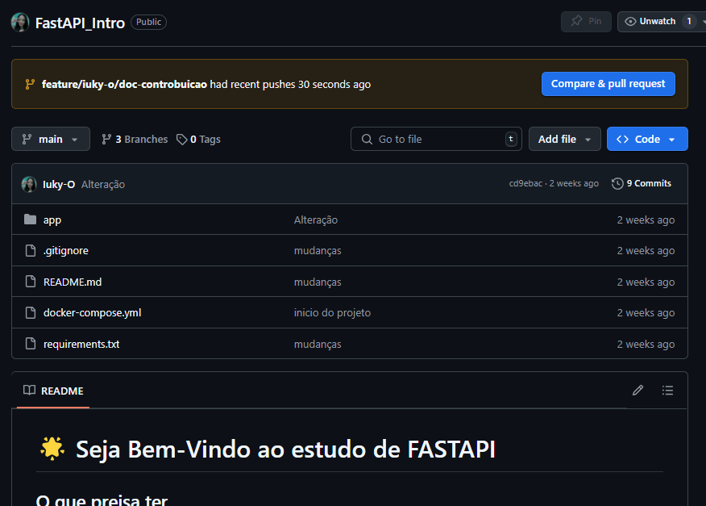
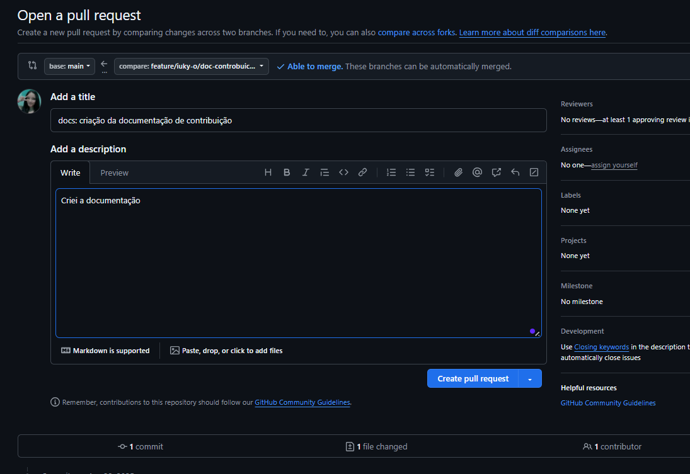

# 📘 Como enviar PR - Pull Request

Obrigado por contribuir com este projeto! Para manter a organização, qualidade e rastreabilidade do código, siga rigorosamente as diretrizes abaixo.

---

## 📌 Fluxo de Trabalho (Git Flow)

1. **Clonar o repositório:**

Em uma pasta onde deseja por seu repositório abra no terminal e faça:

```bash
   git https://github.com/Iuky-O/FastAPI_Intro.git
   cd FastAPI_Intro
   code . #para entrar no VS Code
```

2. **Criar sua branch de desenvolvimento a partir da main:**

- Nomeie no padrão: feature/seu-usuario/nome-da-tarefa

- Se já estiver em main pule o primiero passo, se não faça todos.

- Exemplo:
```bash
    git checkout main
    git pull origin main
    git checkout -b feature/iuky-o/criacao-login
```

3. **Desenvolver sua funcionalidade normalmente.**

- Vai entrar automaticamente na sua branch de desenvolvimento
- Faça sua mudanças aqui (sua branch)

4. **Adicionar e commitar suas mudanças localmente:**

- Utilize os **Conventional Commits** para escrever seus commits:
    - test: indica qualquer tipo de criação ou alteração de códigos de teste.
    - feat: indica o desenvolvimento de uma nova feature ao projeto.
    - refactor: usado quando houver uma refatoração de código que não tenha qualquer tipo de impacto na lógica/regras de negócio do sistema.
    - fix: utilizado quando há correção de erros que estão gerando bugs no sistema.
    - chore: indica mudanças no projeto que não afetem o sistema ou arquivos de testes. São mudanças de desenvolvimento.
    - docs: usado quando há mudanças na documentação do projeto.
    - revert: indica a reverão de um commit anterior.

    Leia mais em: [Conventional Commits](https://medium.com/linkapi-solutions/conventional-commits-pattern-3778d1a1e657)

- Exemplo:

```bash
    git add . ## OU git add caminho/do/seu/documento.py
    git commit -m "feat: implementar tela de login"
```

5. **Enviar sua branch para o repositório remoto:**

- Envie as alterações para a SUA branch
- Mescle com a branch de DEV

5. 1. **Mescle com DEV:**

- Vá até a branch Dev e baixe as atualizações
- Volte pra sua branch de desenvolvimento
- Mescle com dev com sua branch da desenvolvimento

```bash
    git checkout dev
    git pull
    git checkout feature/iuky-o/criacao-login
```

5. 2. **Envie suas alterações:**

- Exemplo:
```bash
    git push -u origin feature/iuky-o/criacao-login
```

**OBS: caso dê CONFLITO:**
- Resolva manualmente
- Adicione as mudanças

```bash
    git add . ## OU git add caminho/do/seu/documento.py
    git commit
```
- Faça o push

```bash
    git push -u origin feature/iuky-o/criacao-login
```

6. **Abrir um Pull Request (PR) da sua feature/* para a branch dev:**

- Vá até o repositório e entre o **Compare e pull request** como na imagem:



- Depois mude a branch de mesclagem onde está **base: main** mude para dev



- Título do PR: vai ser o que envio no commit

- Descreva claramente o que foi feito e o motivo.

- Se foi criado uma variável de ambiente comunique.

7. **Merge na dev:**

- Após aprovação (mínimo 1 revisor), a branch será mesclada em dev.

- Se houver conflitos, resolva na sua branch local antes de tentar o merge.

8. **Merge da dev para a main:**

- Será feito apenas após testes e validação de que o sistema está estável.

- Somente via Pull Request.
